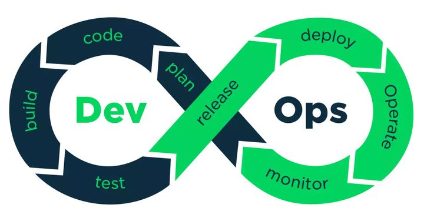

[DevOps](https://www.zhihu.com/question/58702398 ':target=_block domain driver desgin')
## 什么是DevOps   

?> &emsp;&emsp;上个世纪40年代，世界上第一台计算机诞生。从诞生之日起，它就离不开程序（Program）的驱动。而负责编写程序的人，就被称为“程序员”（Programmer）。
随着人类科技的不断发展，PC和Internet陆续问世，我们进入了全民拥抱信息化的时代。越来越多的企业开始将计算机作为办公用的工具，用以提升生产力。而普通个人用户也开始将计算机作为娱乐工具，用以改善生活品质。
于是，计算机的程序，开始变成了一门生意。程序，逐步演进为“软件（software）”，变成了最赚钱的产品之一。
在软件产业里，程序员有了更专业的称谓，叫做“软件开发工程师（Software Development Engineer）”，也就是我们常说的“码农”。                 

&emsp;&emsp;众所周知，一个软件从零开始到最终交付，大概包括以下几个阶段：规划、编码、构建、测试、发布、部署和维护。
<figure class="thumbnails">
    
</figure>

**软件早期:**  &emsp;&emsp;程序比较简单，工作量不大，程序员一个人可以完成所有阶段的工作。

<figure class="thumbnails">
    
</figure>

**软件中期：** 软件产业的日益发展壮大，软件的规模也在逐渐变得庞大。软件的复杂度不断攀升。 一个人已经hold不住了，就开始出现了精细化分工。

<figure class="thumbnails">
    
</figure>

?> &emsp;&emsp;分工之后，传统的软件开发流程是这样的：软件开发人员花费数周和数月编写代码，然后将代码交给QA（质量保障）团队进行测试，然后将最终的发布版交给运维团队去布署。所有的这三个阶段，即开发，测试，布署。
早期所采用的软件交付模型，称之为“瀑布（Waterfall）模型”。       
   
&emsp;&emsp;随着时间推移，用户对系统的需求不断增加，与此同时，用户给的时间周期却越来越少。在这个情况下，大家发现，笨重迟缓的瀑布式开发已经不合时宜了。
              
?>  &emsp;&emsp;于是，软件开发团队引入了一个新的概念，那就是大名鼎鼎的——“敏捷开发（Agile Development）”。
敏捷开发在2000年左右开始被世人所关注，是一种能应对快速变化需求的软件开发能力。其实简单来说，就是把大项目变成小项目，把大时间点变成小时间点     
&emsp;&emsp;有两个词经常会伴随着DevOps出现，那就是CI和CD。CI是Continuous Integration（持续集成），而CD对应多个英文，Continuous Delivery（持续交付）或Continuous Deployment（持续部署）
<figure class="thumbnails">
    
    
</figure>

<figure class="thumbnails">
    
</figure>

&emsp;&emsp;虽然敏捷开发大幅提升了软件开发的效率和版本更新的速度，但是它的效果仅限于开发环节。
研发们发现，运维那边，依旧是铁板一块，成为了新的瓶颈。
运维工程师，和开发工程师有着完全不同的思维逻辑。运维团队的座右铭，很简单，就是“稳定压倒一切”。运维的核心诉求，就是不出问题。

什么情况下最容易出问题？发生改变的时候最容易出问题。所以说，运维非常排斥“改变”。

这个时候，我们的DevOps，隆重登场了。
### DevOps定义  

!> DevOps目前并没有权威的定义     
维基百科定义: DevOps是一组过程、方法与系统的统称，用于促进开发、技术运营和质量保障（QA）部门之间的沟通、协作与整合。     
网易云认为:  DevOps 强调的是高效组织团队之间如何通过自动化的工具协作和沟通来完成软件的生命周期管理，从而更快、更频繁地交付更稳定的软件。
 <figure class="thumbnails">
     
      
 </figure>

## 目标
 DevOps就是让开发人员和运维人员更好地沟通合作，通过自动化流程来使得软件整体过程更加快捷和可靠。     
 DevOps并不仅仅是组织架构变革，更是企业文化和思想观念的变革  。如果不能改变观念，即使将员工放在一起，也不会产生火花。       
 在DevOps的流程下，运维人员会在项目开发期间就介入到开发过程中，了解开发人员使用的系统架构和技术路线，从而制定适当的运维方案。而开发人员也会在运维的初期参与到系统部署中，并提供系统部署的优化建议。
 
 支持DevOps的软件：
 
 <figure class="thumbnails">
     
 </figure>

## 关键要素

技术（工具和平台）是最容易实现的，流程次之，思维转变反而最困难。        
换言之，DevOps考验的不仅是一家企业的技术，更是管理水平和企业文化。        
对比前面所说的瀑布式开发和敏捷开发，我们可以明显看出，DevOps贯穿了软件全生命周期，而不仅限于开发阶段。
 <figure class="thumbnails">
     
 </figure>
 
## DevOps的发展现状

DevOps这个词来源于2009年在比利时根特市举办的首届DevOpsDays大会，为了在Twitter上更方便的传播，由DevOpsDays缩写为DevOps。
目前，DevOps处于高速增长的阶段。尤其是在大企业中，DevOps受到了广泛的欢迎

## DevOps与虚拟化、容器、微服务
随着云计算技术突飞猛进，大家应该对虚拟化、容器、微服务这些概念并不陌生。当我们提到这些概念的时候，也会偶尔提及DevOps。

?> 设想一下，如果要对一项工作进行精细化分工，我们是对一个大铁疙瘩进行加工方便？还是拆成一块一块进行加工更加方便？

显然是拆分之后会更加方便，所谓“微服务”，就是将原来黑盒化的一个整体产品进行拆分（解耦），从一个提供多种服务的整体，拆成各自提供不同服务的多个个体。
