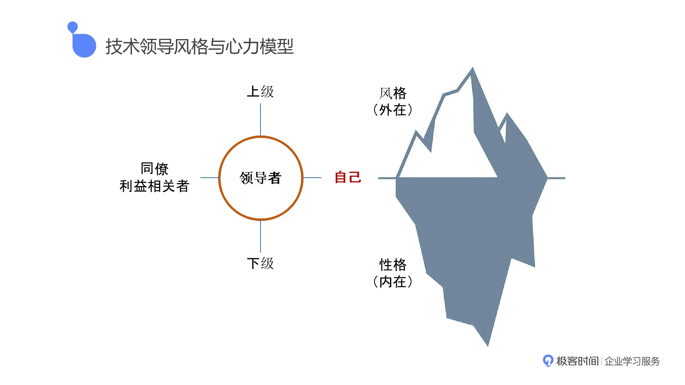
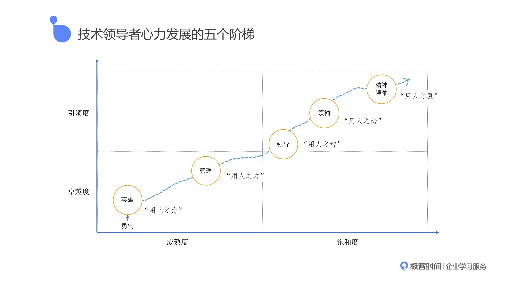
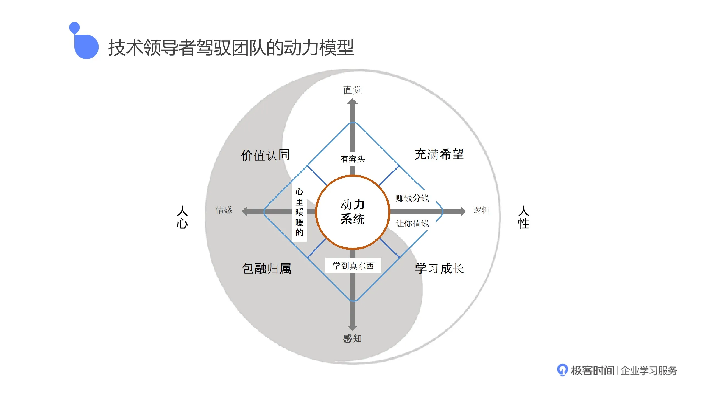
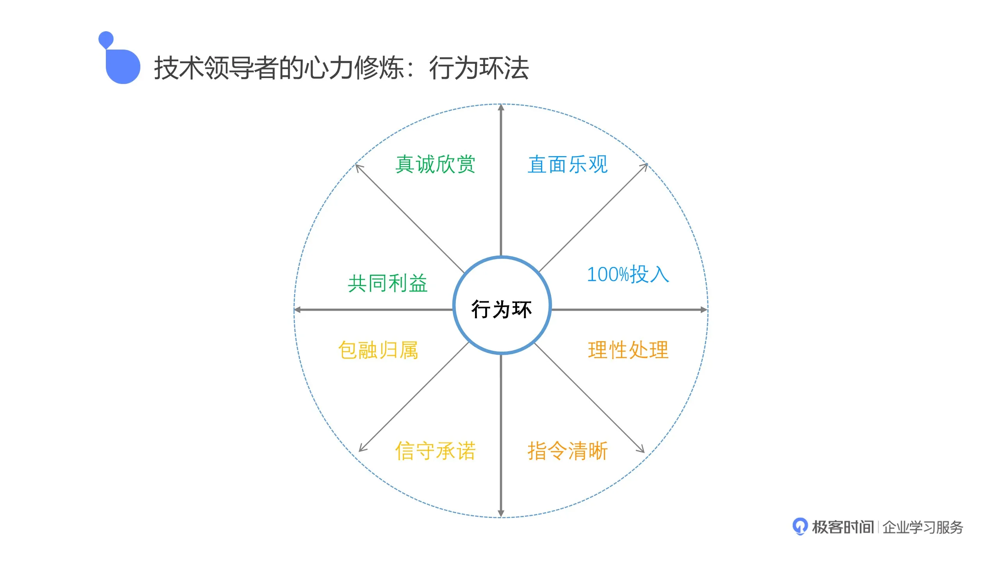

[提升领导力](https://www.infoq.cn/article/aeNSNxG77Xa7P0sS9wu0 ':target=_block domain driver desgin')
## 领导风格与心力模型   
 
!> 想处理好跟其他人的关系，最核心的底层是先处理好自己跟自己的关系。

<figure class="thumbnails">
    
</figure>

## 进阶阶梯

!> 如何去修炼自己作为领导者的心力

 <figure class="thumbnails">
     
 </figure>

## 团队动力模型

!> 前述阶梯推进的基础上，我们用什么样的模型能帮助员工塑造内心的动力？

 <figure class="thumbnails">
     
 </figure>

## 行为环

?> 怎么让别人感受到动力。这个动力不是你要求别人行为发生改变就可以改变的，这个动力是我要求自己改变，通过自己的沟通，通过自己的思想，通过自己的行为，让对方感受到我的这种力量，这种力量传递到他身上就会形成他的自驱力。
 <figure class="thumbnails">
     
 </figure>
