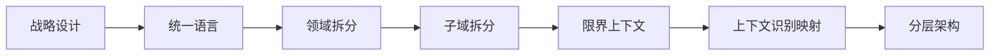

[DDD模式](https://www.cnblogs.com/wayfarer/archive/2010/06/30/1768694.html ':target=_block domain driver desgin')

[实战参考](https://www.cnblogs.com/yubaolee/p/Catalogue.html ':target=_block domain driver desgin')     
[一文看懂领域驱动设计](https://zhuanlan.zhihu.com/p/347603268 ':target=_block domain driver desgin')  
[ddd-simple](https://github.com/citerus/dddsample-core ':target=_block domain driver desgin')

[权限设计](http://demo.openauth.me:1803/#/login ':target=_block domain driver desgin')

## 简介    
 
!> DDD模式 即 Domain-Driven Design领域驱动设计。简称DDD    
你想要的大概都在这里了
## 步骤

## 核心
?> &emsp;&emsp;领域驱动设计的关注重心是领域，尤其在面对复杂的领域逻辑时，它总能够帮助我们很好地分析领域。领域驱动设计的基础是领域建模。 
Eric认为需要和领域专家良好地合作，从交谈中发现通用语言，找到领域的关键词。领域建模是迭代的过程，根据逐渐深入的领域知识来精化模型。不过，领域驱动设计并不排斥其他的分析技术，例如分析模式，或者通过测试驱动开发来引导我们找到问题域的领域模型。

[github排行榜](https://www.githubs.cn/top/Java ':target=_block github排行榜')    
[spring全家桶](https://spring.io/projects/spring-cloud-consul#samples "spring全家桶") 
*****
##### 桌面应用
[electron 桌面应用](http://www.electronjs.org/docs ':crossorgin')  字节跳动开源
##### 前端
[casic-template](https://github.com/liwenhao666/casic-template ':crossorgin')   
[casic-template](http://www.electronjs.org/docs ':crossorgin')      

##### 后端
[casic-template](https://github.com/liwenhao666/casic-template ':crossorgin')  
